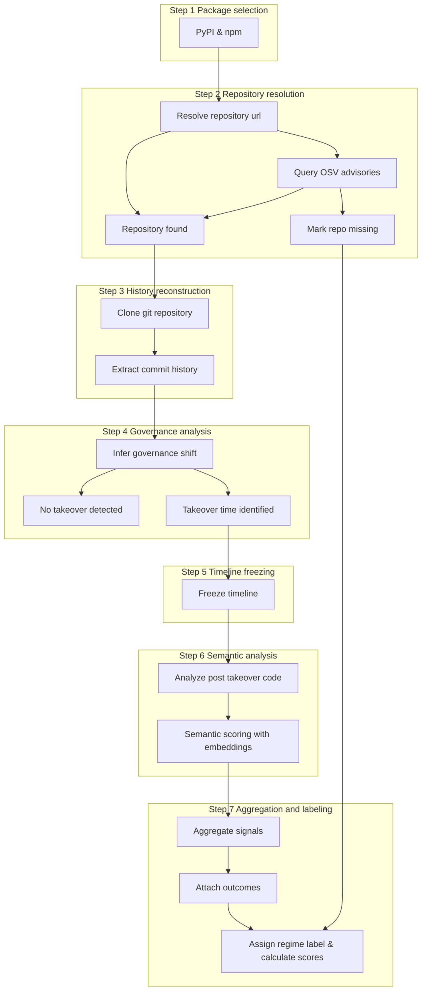

# Data Collection Pipeline

The dataset will be constructed through this multi-stage pipeline. The pipeline will determine which packages to audit, identify drift based on author patterns and workflows, and generate a risk score to simplify and scale auditing and observablity goals of open source ecosystems. 



# 1. Determining Packages from Ecosytem

npm has roughly 3.1 million packages and PyPI has roughly half a million. It seems too costly to review the entire ecosystems. To scope this project, the amount of  reverse dependencies will be used to determine which packages should be included in the dataset and analysis. If a malicious actor is going to target the supply chain, these would be the highest value targets to spread their attacks. 

## PyPI reverse dependency counts (BigQuery)

The script `scripts/pypi_reverse_deps.py` queries the BigQuery public dataset
`bigquery-public-data.pypi.distribution_metadata` to compute reverse dependency
counts using the latest release metadata per project. The CSV output includes the
package name and the number of distinct projects that depend on it.

**Data source**

- BigQuery public dataset: `bigquery-public-data.pypi.distribution_metadata`

**Query used**

```sql
WITH latest AS (
  SELECT project, requires_dist
  FROM (
    SELECT
      project,
      requires_dist,
      ROW_NUMBER() OVER (PARTITION BY project ORDER BY upload_time DESC) AS rn
    FROM `bigquery-public-data.pypi.distribution_metadata`
  )
  WHERE rn = 1
),
parsed AS (
  SELECT
    project AS depender,
    LOWER(REGEXP_EXTRACT(req, r'^([A-Za-z0-9_.-]+)')) AS dependency
  FROM latest,
  UNNEST(requires_dist) AS req
  WHERE req IS NOT NULL
)
SELECT
  dependency AS package,
  COUNT(DISTINCT depender) AS reverse_dependency_count
FROM parsed
WHERE dependency IS NOT NULL
GROUP BY package
ORDER BY reverse_dependency_count DESC
```

**Credentials and rate limits**

- You must have a Google Cloud project with BigQuery enabled for billing.
- Authenticate using Application Default Credentials (ADC), for example:
  - `gcloud auth application-default login`, or
  - set `GOOGLE_APPLICATION_CREDENTIALS` to a service account JSON key.
- BigQuery public datasets are free to access, but query costs apply to your
  project. Use `--limit` to constrain output size and reduce query cost.

**Usage**

```bash
python scripts/pypi_reverse_deps.py --output pypi_reverse_deps.csv --limit 10000
```

# 2. Resolve the canonical repository

Given a package name,  the pipeline determines where the authoritative source code lives. The risk in the process, is that problematic code might get yanked from distribution channels. The proposed pipeline is to determine the source of the truth via the https://google.github.io/osv.dev/data/

### npm

- `repository` field in `package.json`

### PyPI

- `project_urls`
- `home_page`
- `Source` links

If a GitHub URL is present, it will be used as a source of truth.

## **OSV**

Will be used as a historical index. It captures the references even if PyPI does take down the malcious

packages. It maintains links to repos, commits, releases, etc.  

## 3. History Reconstruction

Suggested data fields to extract to construct dataset. In order to ensure authorship, LLM Code Authorship Detection should be considered. 

| Field | Type | Required | Description |
| --- | --- | --- | --- |
| `semantic_id` | string | yes | semantic identifier ( `commit_msg:<hash>`, `pr_comment:<hash>:01`) |
| `package_id` | string | yes | Package identifier (e.g. `pypi:requests`) |
| `repo_url` | string | yes | Canonical repository URL |
| `commit_hash` | string | yes | Immutable git commit identifier |
| `unit_type` | enum | yes | `commit_message`, `pr_title`, `pr_description`, `pr_comment`, `discussion_thread` |
| `text` | text | yes | Raw or sanitized text content |
| `created_time` | timestamp | no | When the text was authored |
| `role` | enum | no | `author`, `reviewer`, `maintainer`, `bot`, `unknown` |
| `position` | int | no | Order within parent (e.g. comment index) |
| `platform` | enum | yes | `github`, `gitlab`, `other` |
| `source` | enum | yes | `git`, `pull_request` |
| `author` | string | no | Derived from LCAD |

## OSV Field Mapping for Required Dataset Fields

This section maps each required dataset field to OSV schema fields when available, plus external sources when OSV does not carry the data. Field paths use OSV JSON pointer-style notation.

### Example OSV JSON (annotated)

```json
{
  "id": "OSV-2023-EXAMPLE",
  "affected": [
    {
      "package": { "ecosystem": "PyPI", "name": "requests" },
      "ranges": [
        {
          "type": "GIT",
          "repo": "https://github.com/psf/requests",
          "events": [
            { "introduced": "0" },
            { "fixed": "2.31.0" }
          ]
        }
      ]
    }
  ],
  "references": [
    { "type": "REPOSITORY", "url": "https://github.com/psf/requests" },
    { "type": "FIX", "url": "https://github.com/psf/requests/commit/abc123def456" }
  ]
}
```

### Required field mapping

| Dataset field | OSV field path(s) | Example OSV value | Fallback/external source when missing |
| --- | --- | --- | --- |
| `semantic_id` | *Not in OSV* | N/A | Derived during pipeline: `commit_msg:<commit_hash>` or `pr_comment:<pr_id>:<index>` |
| `package_id` | `/affected/*/package/ecosystem` + `/affected/*/package/name` | `pypi:requests` (normalize as `<ecosystem>:<name>`) | Package registry metadata (PyPI JSON API, npm registry) |
| `repo_url` | `/affected/*/ranges/*/repo` and `/references/*` where `type == "REPOSITORY"` | `https://github.com/psf/requests` | Package metadata (`package.json.repository`, PyPI `project_urls`/`home_page`) |
| `commit_hash` | `/references/*` where `type == "FIX"` or `type == "EVIDENCE"` and URL contains a commit | `abc123def456` (parse from commit URL) | VCS history (git log), advisory text, or release tags resolved to commits |
| `unit_type` | *Not in OSV* | N/A | Derived from ingestion source: `commit_message`, `pr_title`, `pr_description`, `pr_comment`, `discussion_thread` |
| `text` | *Not in OSV* | N/A | VCS commit messages, PR bodies/comments, issue/discussion text |
| `platform` | `/references/*/url` (infer host) or `/affected/*/ranges/*/repo` | `github` (from `github.com` hostname) | Repo URL from package metadata |
| `source` | *Not in OSV* | N/A | Derived from ingestion: `git` for commit-based units, `pull_request` for PR-based units |

### Fallback rules

1. **Repository URL**: use OSV `ranges.repo` first, then OSV `references` with `type: "REPOSITORY"`. If missing, fall back to package metadata (npm `repository`, PyPI `project_urls`/`home_page`).
2. **Commit hash**: extract from OSV `references` entries containing commit URLs (`type: "FIX"` preferred). If missing, resolve from VCS history using tags or advisory text, or skip the commit-level unit.
3. **Package ID**: derive from OSV `affected.package` fields when present; otherwise, use registry metadata for the package in scope.
4. **Textual semantic units** (`unit_type`, `text`): OSV does not include these; they must be collected from the repository host APIs or git data.

# 4. Governance Analysis

The objective is to infer when control of a repository  changed using features based  in authorship, commit/PR content and activity. The goal is to discern other colaboartive patterns. For instance, the analysis should discern a conversation between a senior and junior dicussing a change and a malicious actor attempting to influence a package. 

Features to observe from dataset:

- unseen author begins contributing
    - author commits frequently
    - becomes committer or merger

 

Maintainer disappearance

- Established authors abandon project
- Commit rate increases suddenly after long inactivity.

Semantic Information

- From `semantic_units` where `unit_type = commit_message`, you can extract **non-judgmental semantic signals** such as:
    - **Work type**
        - maintenance
        - refactor
        - feature addition
        - release or version bump
    - **Framing**
        - “cleanup”, “minor fix”, “chore”
    
    # 5. Timeline
    
    The objective of this part of the pipeline is to ground activity windows based on inferred governance shifts. This is to avoid hindsight bias, label leakages, and other containmentation concerns. 
    
    The data segmented into windows will include 
    
    - The commits included after a  governance shift
        - The diffs associated with those commits.
    - Reviewer dicussion in Pull Requests and meta data associated.
    - 
    
    One expected issue will be conducting analysis on large diffs. To make it more mangeable, it appears advisable based on the literature to chunck boundaries based on the next file marker, the previous newline, and then the middle. 
    
    # 6. Semantic Analysis
    
    The semantic analysis will be conducted at several levels. The general modalities are textual input, code input, and multi-modal capturing the correspondance between the two. LLM Code Patterns could be used to to create the vectors 
    
    - Text
        - Commit
        - Pull Request
            - Changes in specific nature of language
        - Discussion
            - justification not explaining the commits
    - Code
        - Diff level changes
    - Multi-modal
        - Correspondance between commit messages and PR and the nature of the change
            - Small refactor with many files being updated
    
    Semantic IDs are leveraged to project different semantic units into the same space to make drifts or take over more observable. 
    
    For instance, semantic IDs would allow 
    
    - Observation of PRs written by the same author at the window level
    - Comparison of pre and post governance shift by the author
    
    Additional analysis could cluster PRs and determine those the drift to determine PRs that are more likely to suggest malicious activity. 
    
    This can be be emulated on the author level by grouping authors in the same sematnic space and aggregated per author per window. Analysis of authors at this level would determine variation in semantics and could be suggestive of take over.  
    
    By combining the analysis of the PRs and author, the following research questions could be addressed:
    
    - Do PRs authored by a new maintainer cluster differently?
    - Does an author’s semantic profile move toward a suspicious PR cluster?
    
# 7. Labeling
    
    The reporting  from aggregations will be used to inform labeling of anonmolous PR and authors.  
    
    A risk score will be calculated based on semantic behavior changes after a governance shift. It will capture drift in embedding space for pull requests and contributor behavior. 
    
    Given the embeddings of semantic units from author’s and their Pull Requests at the window level we can use embeddings to calculate centroids of the pre and post governance shift. 
    
    - PR-level embeddings  $\mathbf{v}_{PR}$
    - Author-window embeddings $\mathbf{v}_{A,w}$
    
    $$
    
    \mu^{PR}_{\text{pre}} =
    \frac{1}{|\mathcal{P}_{\text{pre}}|}
    \sum_{p \in \mathcal{P}_{\text{pre}}} \mathbf{v}_p
    
    \\
    
    \mu^{PR}_{\text{post}} =
    \frac{1}{|\mathcal{P}_{\text{post}}|}
    \sum_{p \in \mathcal{P}_{\text{post}}} \mathbf{v}_p
    \\
    
    D_{\text{PR}} =
    1 - \cos\!\left(
    \mu^{PR}_{\text{pre}},
    \mu^{PR}_{\text{post}}
    \right)
    
    $$
    
    The goal of this formulation is to identify authors whose behavior has changed by measuring semantic drift in contributor behavior before and after governance shifts. By aggregating embeddings over semantic units and computing the distance between pre- and post-change representations, the method captures how an author’s contribution profile has moved through semantic space over time, rather than reacting to isolated edits.
    
    $$
    \mu_{a,\text{pre}}=\operatorname{Agg}\left(\{\mathbf{v}_u \mid u \in \mathcal{U}_{a,\text{pre}}\}\right)\\
    \mu_{a,\text{post}}=\operatorname{Agg}\left(\{\mathbf{v}_u \mid u \in \mathcal{U}_{a,\text{post}}\}\right)
    \\ D_a=1-\cos\left(\mu_{a,\text{pre}},\mu_{a,\text{post}}\right)\\
    D_{\text{author}}=\max_{a \in \mathcal{A}_{\text{new}}}D_a
    $$
    

The proposed risk metric attempts to balance semantic drift in Pull Requests and semantic drift in the author’s contribution behavior before and after goverance shifts.  $\alpha$ is a tuning parameter to balance how much either Pull Requests and other arefacts infleunce the determination and author drift contribute to the risk score. 

$$
R=\alpha \cdot D_{\mathrm{PR}}+(1 - \alpha) \cdot D_{\mathrm{author}}\\
\alpha \in  [0, 1]
$$

# Pipeline Outputs & Evaluation

The pipeline emits JSONL artifacts for each phase under `data/`:

- `packages.jsonl`: ecosystem scoping with reverse dependency counts.
- `resolved_repos.jsonl`: canonical repo resolution with OSV/registry sources.
- `semantic_units.jsonl`: commit/PR text units for semantic analysis.
- `governance_shifts.jsonl`: inferred shift windows.
- `windows.jsonl`: post-shift windows with diff chunks.
- `embeddings.parquet`: deterministic text/diff embeddings.
- `risk_scores.jsonl`: drift-based risk scores.

To evaluate a simple classifier trained on the risk score against known takeovers:

```bash
python -m scripts.pipeline.evaluate_classifier \
  --risk-scores data/risk_scores.jsonl \
  --known-takeovers data/known_takeovers.csv \
  --output data/classifier_report.json
```

For a full run with evaluation enabled:

```bash
python -m scripts.pipeline.run_pipeline --pypi-csv pypi_reverse_deps.csv --npm-csv npm_reverse_deps.csv --evaluate
```

## Benchmarking with plots

Generate a balanced benchmark dataset (known takeovers vs normal packages), train a classifier on the risk score, and emit plots:

```bash
python -m scripts.pipeline.benchmark \
  --risk-scores data/risk_scores.jsonl \
  --known-takeovers data/known_takeovers.csv \
  --output-dir data/benchmark
```

This writes:

- `data/benchmark/benchmark_report.json` (accuracy, precision, recall, AUC)
- `data/benchmark/risk_score_histogram.png`
- `data/benchmark/roc_curve.png`
